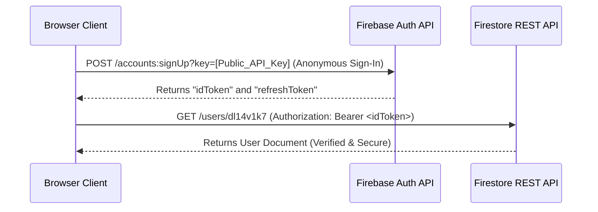

# Pure Firestore REST API Architecture Guide (No-Backend Mandate)

This document establishes the mandatory architectural pattern agreed upon for the project deployed at `https://users-d5m.pages.dev/`. 

> [!IMPORTANT]
> **STRICT ARCHITECTURAL RULE: ZERO COMPUTATIONAL BACKEND**
> 
> Under no circumstances shall this project utilize, deploy, or maintain:
> 1. **Custom Servers** (Node.js, Express, Go, Python, etc.)
> 2. **Serverless Functions** (Firebase Functions, AWS Lambda, Google Cloud Functions, etc.)
> 3. **Edge Compute Middlewares** (Cloudflare Workers, Cloudflare Pages Functions, Next.js API Routes, etc.)
> 4. **Containerized / VPS Hosts** (Docker, Kubernetes, VM instances)
> 
> All operations, data synchronization, and query commands (such as fetching, inserting, updating, and deleting records) **MUST** be performed directly and exclusively via the **Firebase Firestore REST API** from the client environment (web browser, local CLI/cURL, or direct webhook integrations). 

---

## 1. Project Configuration & Base URL

* **Project ID**: `users-baad9`
* **Base REST Endpoint**:
  ```http
  https://firestore.googleapis.com/v1/projects/users-baad9/databases/(default)/documents
  ```

Every database command is structured as a standard HTTP request (`GET`, `POST`, `PATCH`, `DELETE`) directed to this base endpoint.

---

## 2. Predefined Commands & API Endpoints

Below are the exact HTTP configurations and cURL command examples representing the pre-defined operations for the five database collections.

### A. Users Collection (`/users`)
*Stores core user profiles. The document ID is the unique `user_key` (e.g., `dl14v1k7`).*

* **Command: Get All Users**
  ```bash
  curl -X GET "https://firestore.googleapis.com/v1/projects/users-baad9/databases/(default)/documents/users"
  ```

* **Command: Get User by ID (`user_key`)**
  ```bash
  curl -X GET "https://firestore.googleapis.com/v1/projects/users-baad9/databases/(default)/documents/users/dl14v1k7"
  ```

* **Command: Create/Insert User**
  Pass the new `user_key` in the `documentId` query parameter:
  ```bash
  curl -X POST "https://firestore.googleapis.com/v1/projects/users-baad9/databases/(default)/documents/users?documentId=new_user_key_99" \
       -H "Content-Type: application/json" \
       -d '{
         "fields": {
           "username": { "stringValue": "Mohammed Ali" },
           "phone": { "stringValue": "+201012345678" },
           "system_role": { "stringValue": "user" },
           "is_delivery_eligible": { "integerValue": "0" }
         }
       }'
  ```

* **Command: Update User (Patch Specific Fields)**
  Use `updateMask.fieldPaths` to update only the specified fields, preserving the rest of the document:
  ```bash
  curl -X PATCH "https://firestore.googleapis.com/v1/projects/users-baad9/databases/(default)/documents/users/new_user_key_99?updateMask.fieldPaths=username" \
       -H "Content-Type: application/json" \
       -d '{
         "fields": {
           "username": { "stringValue": "Mohammed Ali (Updated)" }
         }
       }'
  ```

* **Command: Delete User**
  ```bash
  curl -X DELETE "https://firestore.googleapis.com/v1/projects/users-baad9/databases/(default)/documents/users/new_user_key_99"
  ```

---

### B. User Contacts Collection (`/user_contacts`)
*Stores contact phone numbers linked to users. The document ID is a unique UUID.*

* **Command: Get All Contacts**
  ```bash
  curl -X GET "https://firestore.googleapis.com/v1/projects/users-baad9/databases/(default)/documents/user_contacts"
  ```

* **Command: Create Contact**
  ```bash
  curl -X POST "https://firestore.googleapis.com/v1/projects/users-baad9/databases/(default)/documents/user_contacts?documentId=contact_uuid_101" \
       -H "Content-Type: application/json" \
       -d '{
         "fields": {
           "user_key": { "stringValue": "dl14v1k7" },
           "phone_number": { "stringValue": "+201122334455" },
           "contact_type": { "stringValue": "mobile" },
           "is_primary": { "integerValue": "1" },
           "has_whatsapp": { "integerValue": "1" }
         }
       }'
  ```

---

### C. User Capabilities Collection (`/user_capabilities`)
*Stores operational roles and specialty profiles. The document ID is the `user_key`.*

* **Command: Get All Capabilities**
  ```bash
  curl -X GET "https://firestore.googleapis.com/v1/projects/users-baad9/databases/(default)/documents/user_capabilities"
  ```

* **Command: Get Capability by User**
  ```bash
  curl -X GET "https://firestore.googleapis.com/v1/projects/users-baad9/databases/(default)/documents/user_capabilities/dl14v1k7"
  ```

---

### D. User Specialties Collection (`/user_specialties`)
*Stores granular categories and trade mappings. The document ID is an auto-incrementing integer or UUID.*

* **Command: Get All Specialties**
  ```bash
  curl -X GET "https://firestore.googleapis.com/v1/projects/users-baad9/databases/(default)/documents/user_specialties"
  ```

---

### E. User Tokens Collection (`/user_tokens`)
*Stores FCM push notification tokens.*

* **Command: Get All Notification Tokens**
  ```bash
  curl -X GET "https://firestore.googleapis.com/v1/projects/users-baad9/databases/(default)/documents/user_tokens"
  ```

---

## 3. JSON Typed Payload Formats

Firestore's REST API does not consume plain JSON. All values must be explicitly wrapped in their corresponding Firestore type identifier.

| Target Type | Firestore REST Key | Example JSON Payload |
| :--- | :--- | :--- |
| **String** | `stringValue` | `"username": { "stringValue": "Hassan" }` |
| **Integer** | `integerValue` | `"status_code": { "integerValue": "200" }` *(Must be a quoted string)* |
| **Boolean** | `booleanValue` | `"is_active": { "booleanValue": true }` |
| **Array** | `arrayValue` | `"roles": { "arrayValue": { "values": [{ "stringValue": "admin" }] } }` |
| **Map** | `mapValue` | `"metadata": { "mapValue": { "fields": { "ip": { "stringValue": "127.0.0.1" } } } }` |

---

## 4. Pure Client Security & Direct Authentication

Since we have **no backend intermediate layers**, secret API keys or Google Service Account JSON keys **MUST NOT** be embedded in the static client code.

To secure data access while keeping the application serverless, we implement one of two direct client-side patterns:

### Direct Client Pattern A: Anonymous User Auth Flow (Recommended)
For browser-based environments, Firebase Security Rules are configured to authorize operations only for authenticated requests. The browser client authenticates anonymously, obtains an ID token, and queries Firestore directly.



#### Step 1: Request an Anonymous Session Token
The client sends an HTTP request directly to the Firebase Auth public endpoint:
```bash
curl -X POST "https://identitytoolkit.googleapis.com/v1/accounts:signUp?key=[YOUR_PUBLIC_FIREBASE_API_KEY]" \
     -H "Content-Type: application/json" \
     -d '{"returnSecureToken": true}'
```
This returns a JSON response containing an `idToken`:
```json
{
  "idToken": "eyJhbGciOiJSUzI1NiIs...",
  "refreshToken": "...",
  "expiresIn": "3600",
  "localId": "anonymous_user_id"
}
```

#### Step 2: Make Authenticated Firestore Requests
The client passes the `idToken` inside the standard HTTP `Authorization` header:
```bash
curl -X GET "https://firestore.googleapis.com/v1/projects/users-baad9/databases/(default)/documents/users/dl14v1k7" \
     -H "Authorization: Bearer [ID_TOKEN]"
```

---

### Direct Client Pattern B: Public Document Read Rules
For completely read-only collections (such as `/user_specialties` or public user profiles) where authentication overhead is not desired, the Firestore Security Rules are customized to allow public reads while strictly locking writes:

```javascript
rules_version = '2';
service cloud.firestore {
  match /databases/{database}/documents {
    // Public reading allowed for specialties, but write is fully denied
    match /user_specialties/{document} {
      allow read: if true;
      allow write: if false;
    }
    
    // Core users can only be read/written by authenticated anonymous or registered users
    match /users/{userId} {
      allow read, write: if request.auth != null;
    }
  }
}
```

By leveraging these native Firebase mechanisms, the project remains 100% serverless, fast, and completely safe without a single line of backend compute.
