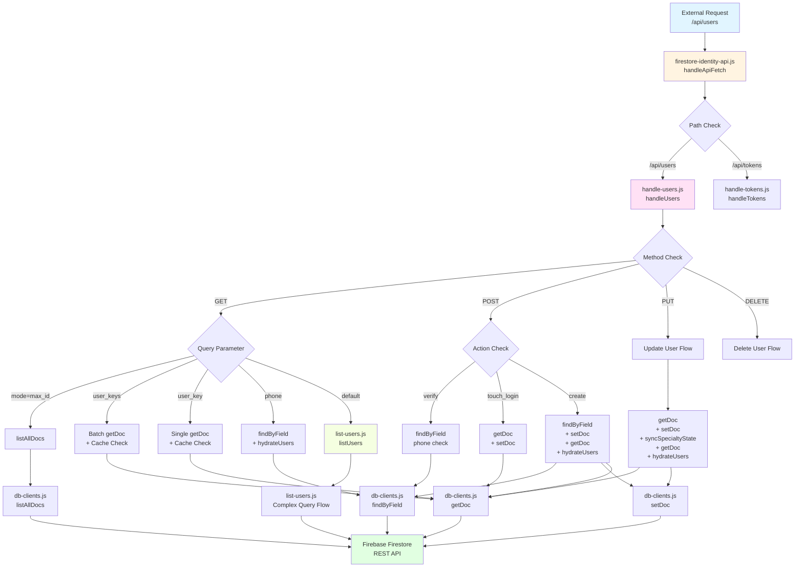
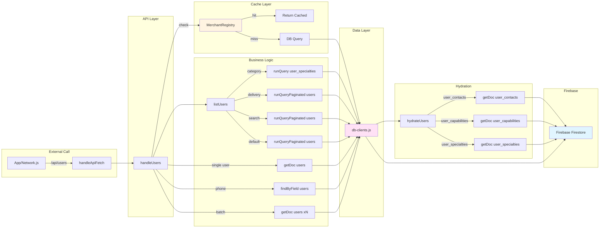

# مخطط تدفق القراءات (Read Flow Graph)

## الملفات المصدر

1. `js/shared/firestore-identity-api.js` - نقطة الدخول العامة
2. `js/shared/firestore-identity/handle-users.js` - معالجة طلبات المستخدمين
3. `js/shared/firestore-identity/list-users.js` - قائمة المستخدمين
4. `js/api-client/db-clients.js` - عميل Firestore REST API

---

## مخطط التدفق العام



---

## تدفق القراءات التفصيلي

### 1. نقطة الدخول (Entry Point)

**firestore-identity-api.js**
```javascript
async function handleApiFetch(endpoint, options) {
    const path = new URL(endpoint, global.location.origin).pathname;
    if (path === "/api/users") return handleUsers(endpoint, options);
    if (path === "/api/tokens") return handleTokens(endpoint, options);
}
```

**القراءات المباشرة:**
- لا يوجد (مجرد توجيه)

---

### 2. معالجة طلبات المستخدمين (handle-users.js)

#### GET Requests - قراءة البيانات

**2.1 الحصول على max_id**
```javascript
if (params.get("mode") === "max_id") {
    const rows = await listAllDocs("users", { maxRows: 5000 });
    return { max_id: rows.reduce((max, row) => Math.max(max, Number(row.id || 0)), 0) };
}
```
- **القراءة**: `listAllDocs("users")` → db-clients.js
- **الهدف**: الحصول على أكبر معرف مستخدم

**2.2 الحصول على مستخدمين متعددين (user_keys)**
```javascript
if (params.get("user_keys")) {
    const keys = params.get("user_keys").split(",").map((key) => key.trim()).filter(Boolean);
    const cachedUsers = [];
    const missingKeys = [];
    
    // التحقق من الكاش أولاً
    if (global.MerchantRegistry) {
        keys.forEach((key) => {
            const cached = global.MerchantRegistry.get(key);
            if (cached) cachedUsers.push(cached);
            else missingKeys.push(key);
        });
        if (!missingKeys.length) return cachedUsers; // كلها من الكاش
    }
    
    // جلب المفقود من قاعدة البيانات
    const rows = await Promise.all(missingKeys.map((key) => getDoc("users", key)));
    const hydrated = await hydrateUsers(rows, { compact: true });
    
    // حفظ في الكاش
    hydrated.forEach((user) => {
        if (global.MerchantRegistry && user?.user_key) {
            global.MerchantRegistry.set(user.user_key, user);
        }
    });
    
    return [...cachedUsers, ...hydrated];
}
```
- **القراءات**: 
  - `MerchantRegistry.get(key)` - كاش محلي
  - `getDoc("users", key)` - قاعدة البيانات (للمفاتيح المفقودة)
  - `hydrateUsers(rows)` - تحميل البيانات المرتبطة
- **الهدف**: جلب مستخدمين متعددين بكفاءة

**2.3 الحصول على مستخدم واحد (user_key)**
```javascript
if (params.get("user_key")) {
    const userKey = params.get("user_key");
    const cachedUser = global.MerchantRegistry ? global.MerchantRegistry.get(userKey) : null;
    if (cachedUser) {
        console.log(`[FirestoreIdentityApi] user_key cache hit in MerchantRegistry: ${userKey}`);
        return cachedUser;
    }
    const rows = await hydrateUsers([await getDoc("users", userKey)]);
    if (!rows[0]) return { error: "المستخدم غير موجود.", code: "USER_NOT_FOUND" };
    if (global.MerchantRegistry && rows[0]) {
        global.MerchantRegistry.set(userKey, rows[0]);
    }
    return rows[0];
}
```
- **القراءات**:
  - `MerchantRegistry.get(userKey)` - كاش محلي
  - `getDoc("users", userKey)` - قاعدة البيانات
  - `hydrateUsers(rows)` - تحميل البيانات المرتبطة
- **الهدف**: جلب مستخدم واحد بكاش

**2.4 البحث برقم الهاتف (phone)**
```javascript
if (params.get("phone")) {
    const phone = normalizePhone(params.get("phone"));
    const rows = await findByField("users", "phone", phone, { limit: 1 });
    if (!rows[0]) return params.get("exists") ? { exists: false } : { error: "المستخدم غير موجود.", code: "USER_NOT_FOUND" };
    if (params.get("exists")) return { exists: true };
    const hydrated = (await hydrateUsers([rows[0]]))[0];
    if (global.MerchantRegistry && hydrated) {
        global.MerchantRegistry.set(hydrated.user_key || hydrated._firestore_id || hydrated.id, hydrated);
    }
    return hydrated;
}
```
- **القراءات**:
  - `findByField("users", "phone", phone)` - قاعدة البيانات
  - `hydrateUsers(rows)` - تحميل البيانات المرتبطة
- **الهدف**: البحث عن مستخدم برقم الهاتف

**2.5 القائمة الافتراضية (listUsers)**
```javascript
return listUsers(params);
```
- **القراءات**: list-users.js (معقدة)
- **الهدف**: قائمة المستخدمين مع فلاتر متعددة

#### POST Requests - قراءة للتحقق

**2.6 التحقق من كلمة المرور (verify)**
```javascript
if (payload.action === "verify") {
    const phone = normalizePhone(payload.phone);
    const rows = await findByField("users", "phone", phone, { limit: 1 });
    const user = rows[0];
    if (!user || String(user.Password || "") !== String(payload.password || "")) {
        return { error: "كلمة المرور أو رقم الهاتف غير صحيح.", code: "INVALID_CREDENTIALS" };
    }
    // ... تحديث last_login_at
    const verifiedUser = (await hydrateUsers([{ ...user, last_login_at: timestamp, updated_at: timestamp }]))[0];
    return verifiedUser;
}
```
- **القراءات**:
  - `findByField("users", "phone", phone)` - قاعدة البيانات
  - `hydrateUsers(rows)` - تحميل البيانات المرتبطة
- **الهدف**: التحقق من صحة بيانات الدخول

**2.7 تحديث وقت الدخول (touch_login)**
```javascript
if (payload.action === "touch_login") {
    if (!payload.user_key || payload.user_key === "guest_user") return { success: false, skipped: true };
    const current = await getDoc("users", payload.user_key);
    // ... تحديث last_login_at
    return { success: true, last_login_at: timestamp };
}
```
- **القراءات**:
  - `getDoc("users", payload.user_key)` - قاعدة البيانات
- **الهدف**: تحديث وقت آخر دخول

**2.8 إنشاء مستخدم (create)**
```javascript
const phones = normalizePhonesPayload(payload.phones, payload);
const aliases = derivePhoneAliases(phones);
const existing = aliases.phone ? await findByField("users", "phone", aliases.phone, { limit: 1 }) : [];
if (existing[0]) return { error: "رقم الهاتف هذا مسجل بالفعل.", code: "PHONE_ALREADY_EXISTS" };
// ... إنشاء المستخدم
const createdUser = (await hydrateUsers([await getDoc("users", userKey)]))[0];
return createdUser;
```
- **القراءات**:
  - `findByField("users", "phone", aliases.phone)` - التحقق من التكرار
  - `getDoc("users", userKey)` - جلب المستخدم المنشأ
  - `hydrateUsers(rows)` - تحميل البيانات المرتبطة
- **الهدف**: إنشاء مستخدم جديد مع التحقق

#### PUT Requests - قراءة للتحديث

**2.9 تحديث مستخدم (update)**
```javascript
const current = await getDoc("users", userKey);
if (!current) continue;
// ... تحديث البيانات
await syncSpecialtyState(updates, "browser_update");
const hydrated = (await hydrateUsers([await getDoc("users", userKey)]))[0];
return hydrated;
```
- **القراءات**:
  - `getDoc("users", userKey)` - جلب البيانات الحالية
  - `getDoc("users", userKey)` - جلب البيانات المحدثة
  - `hydrateUsers(rows)` - تحميل البيانات المرتبطة
- **الهدف**: تحديث بيانات المستخدم

---

### 3. قائمة المستخدمين (list-users.js)

#### تدفق listUsers المعقد

```javascript
async function listUsers(params = {}) {
    const mode = params.get("mode");
    const searchTerm = (params.get("searchTerm") || "").trim();
    const mainId = params.get("main_id");
    const subId = params.get("sub_id");
    const roleParam = params.get("role");
    const cursor = params.get("cursor") || null;
    const limit = Math.min(parseInt(params.get("limit") || "20", 10) || 20, 100);
    
    const needsCategoryFilter = mode === "category_search" || mainId || subId;
    const isDeliveryMode = mode === "delivery_users";
    const hasSearchTerm = searchTerm.length >= 1;
    
    let rows;
    let nextCursor = null;
    
    // 1. التحقق من الكاش - delivery_users
    if (isDeliveryMode && !cursor && !hasSearchTerm && global.MerchantRegistry) {
        const cachedDeliveryUsers = global.MerchantRegistry.getList(`delivery_users_${limit}`);
        if (cachedDeliveryUsers) {
            return { users: paginated, nextCursor, count };
        }
    }
    
    // 2. التحقق من الكاش - category_search
    if (needsCategoryFilter && global.MerchantRegistry) {
        const cachedUsers = global.MerchantRegistry.getCategory(mainId, subId);
        if (cachedUsers) {
            return { users: paginated, nextCursor, count };
        }
    }
    
    // 3. التحقق من الكاش - search
    if (hasSearchTerm && global.MerchantRegistry) {
        const cachedSearchUsers = global.MerchantRegistry.getSearch(merchantSearchKey);
        if (cachedSearchUsers) {
            return { users: paginated, nextCursor, count };
        }
    }
    
    // 4. البحث حسب الفئة - server-side
    if (needsCategoryFilter) {
        const specialtyRows = await runQuery("user_specialties", specialtyWhere || null);
        const matchedUserKeys = Array.from(new Set(
            specialtyRows.map((row) => String(row.user_key || "").trim()).filter(Boolean)
        ));
        const userDocs = await findByFieldIn("users", "user_key", matchedUserKeys);
        rows = userDocs.map(normalizeUserDoc);
    }
    
    // 5. البحث عن مستخدمي التوصيل - server-side
    else if (isDeliveryMode) {
        const result = await runQueryPaginated("users", where, {
            pageSize: limit,
            orderBy,
            startAfterCursor: cursor,
        });
        rows = result.docs.map(normalizeUserDoc);
        nextCursor = result.nextCursor;
    }
    
    // 6. البحث بالنص - server-side
    else if (hasSearchTerm) {
        const result = await runQueryPaginated("users", where, {
            pageSize: limit,
            orderBy,
            startAfterCursor: cursor,
        });
        rows = result.docs.map(normalizeUserDoc);
        nextCursor = result.nextCursor;
    }
    
    // 7. القائمة الافتراضية - server-side
    else {
        const result = await runQueryPaginated("users", where, {
            pageSize: limit,
            orderBy,
            startAfterCursor: cursor,
        });
        rows = result.docs.map(normalizeUserDoc);
        nextCursor = result.nextCursor;
    }
    
    // 8. تحميل البيانات المرتبطة
    const users = await hydrateUsers(rows, { skipRelations });
    
    // 9. حفظ في الكاش
    if (isDeliveryMode && !cursor && !hasSearchTerm && !nextCursor && global.MerchantRegistry && users.length) {
        global.MerchantRegistry.setList(`delivery_users_${limit}`, users);
    }
    
    if (hasSearchTerm && global.MerchantRegistry && users.length) {
        global.MerchantRegistry.setSearch(merchantSearchKey, users);
    }
    
    return { users, nextCursor, count: users.length };
}
```

**القراءات في listUsers:**

1. **الكاش المحلي** (MerchantRegistry):
   - `MerchantRegistry.getList(listKey)` - قوائم محفوظة
   - `MerchantRegistry.getCategory(mainId, subId)` - فئات محفوظة
   - `MerchantRegistry.getSearch(searchKey)` - عمليات بحث محفوظة

2. **قاعدة البيانات** (عند عدم وجود كاش):
   - `runQuery("user_specialties", where)` - البحث في التخصصات
   - `findByFieldIn("users", "user_key", matchedUserKeys)` - جلب مستخدمين متعددين
   - `runQueryPaginated("users", where, options)` - استعلام مع ترقيم صفحات
   - `hydrateUsers(rows)` - تحميل البيانات المرتبطة

---

### 4. عميل Firestore (db-clients.js)

#### دوال القراءة الأساسية

**4.1 getDoc - جلب مستند واحد**
```javascript
async getDoc(collectionName, docId) {
    const doc = await this.firestoreFetch(this.docUrl(collectionName, docId));
    const decoded = decodeDocument(doc);
    this._recordOperation("READ", method, collectionName, decoded ? 1 : 0, startedAt);
    return decoded;
}
```
- **القراءة**: `GET /documents/{collection}/{docId}`
- **الهدف**: جلب مستند واحد من Firestore

**4.2 runQuery - تشغيل استعلام**
```javascript
async runQuery(collectionName, where, options = {}) {
    const structuredQuery = {
        from: [{ collectionId: collectionName }],
    };
    if (where) structuredQuery.where = where;
    if (options.orderBy) structuredQuery.orderBy = options.orderBy;
    if (options.limit) structuredQuery.limit = options.limit;
    
    const rows = await this.firestoreFetch(`${this.baseUrl}:runQuery`, {
        method: "POST",
        body: JSON.stringify({ structuredQuery }),
    });
    
    const decoded = rows.map((item) => decodeDocument(item.document)).filter(Boolean);
    return decoded;
}
```
- **القراءة**: `POST /documents:runQuery`
- **الهدف**: تشغيل استعلام معقد على Firestore

**4.3 listDocs - قائمة المستندات**
```javascript
async listDocs(collectionName, options = {}) {
    const params = new URLSearchParams();
    params.set("pageSize", String(options.pageSize || 500));
    if (options.orderBy) params.set("orderBy", options.orderBy);
    if (options.pageToken) params.set("pageToken", options.pageToken);
    
    const payload = await this.firestoreFetch(`${this.baseUrl}/${collectionName}?${params.toString()}`);
    const decoded = (payload?.documents || []).map((doc) => decodeDocument(doc)).filter(Boolean);
    return {
        rows: decoded,
        nextPageToken: payload?.nextPageToken || null,
    };
}
```
- **القراءة**: `GET /documents/{collection}?pageSize=...`
- **الهدف**: قائمة مستندات مع ترقيم صفحات

**4.4 listAllDocs - قائمة جميع المستندات**
```javascript
async listAllDocs(collectionName, options = {}) {
    const rows = [];
    let pageToken = null;
    do {
        const page = await this.listDocs(collectionName, { ...options, pageToken });
        rows.push(...page.rows);
        pageToken = page.nextPageToken;
    } while (pageToken && rows.length < (options.maxRows || 5000));
    return rows;
}
```
- **القراءة**: `listDocs` متكررة
- **الهدف**: جلب جميع المستندات (حتى 5000)

**4.5 findByField - البحث بحقل**
```javascript
async findByField(collectionName, fieldPath, value, options = {}) {
    return this.runQuery(
        collectionName,
        this.fieldFilter(fieldPath, "EQUAL", value),
        options
    );
}
```
- **القراءة**: `runQuery` مع فلتر EQUAL
- **الهدف**: البحث عن مستندات بقيمة حقل معينة

**4.6 findByFieldIn - البحث بحقل IN**
```javascript
async findByFieldIn(collectionName, fieldPath, values, options = {}) {
    const uniqueValues = Array.from(new Set((Array.isArray(values) ? values : [])
        .map((value) => String(value || "").trim())
        .filter(Boolean)));
    
    const batches = [];
    for (let index = 0; index < uniqueValues.length; index += 30) {
        batches.push(uniqueValues.slice(index, index + 30));
    }
    
    const rows = await Promise.all(
        batches.map((batch) => this.runQuery(
            collectionName,
            this.fieldInFilter(fieldPath, batch),
            options
        ))
    );
    return rows.flat();
}
```
- **القراءة**: `runQuery` مع فلتر IN (دفعات 30)
- **الهدف**: البحث عن مستندات بقيم متعددة

---

## مخطط تدفق القراءات حسب الاستخدام



---

## إحصائيات القراءات

### حسب نوع العملية

| العملية | عدد القراءات | المصدر |
|---------|-------------|--------|
| getDoc | متعددة | handle-users.js, db-clients.js |
| runQuery | متعددة | list-users.js, db-clients.js |
| runQueryPaginated | متعددة | list-users.js |
| findByField | متعددة | handle-users.js, db-clients.js |
| findByFieldIn | متعددة | list-users.js, db-clients.js |
| listAllDocs | واحدة | handle-users.js (max_id) |
| hydrateUsers | متعددة | handle-users.js, list-users.js |

### حسب المجموعة

| المجموعة | عدد القراءات | الاستخدام |
|---------|-------------|-----------|
| users | الأكثر | جميع العمليات |
| user_specialties | متوسطة | البحث حسب الفئة |
| user_contacts | منخفضة | hydrateUsers |
| user_capabilities | منخفضة | hydrateUsers |
| merchant_ratings_v2 | منخفضة | hydrateUsers |

### حسب المصدر

| المصدر | عدد القراءات | النوع |
|--------|-------------|------|
| MerchantRegistry | متعددة | كاش محلي |
| Firebase Firestore | متعددة | قاعدة بيانات عن بعد |

---

## أنماط القراءات الشائعة

### 1. نمط الكاش-أولاً (Cache-First)
```javascript
// 1. التحقق من الكاش
const cached = MerchantRegistry.get(key);
if (cached) return cached;

// 2. جلب من قاعدة البيانات
const doc = await getDoc("users", key);

// 3. حفظ في الكاش
MerchantRegistry.set(key, doc);
```

### 2. نمط الكاش-مع-الدفعات (Batch with Cache)
```javascript
// 1. فصل المفاتيح
const cached = keys.filter(k => MerchantRegistry.get(k));
const missing = keys.filter(k => !MerchantRegistry.get(k));

// 2. جلب المفقود دفعة واحدة
const docs = await Promise.all(missing.map(k => getDoc("users", k)));

// 3. دمج النتائج
return [...cached, ...docs];
```

### 3. نمط الاستعلام-المعقد-مع-الكاش (Complex Query with Cache)
```javascript
// 1. التحقق من الكاش
const cached = MerchantRegistry.getCategory(mainId, subId);
if (cached) return cached;

// 2. استعلام معقد على السيرفر
const specialties = await runQuery("user_specialties", where);
const users = await findByFieldIn("users", "user_key", userKeys);

// 3. حفظ في الكاش
MerchantRegistry.setCategory(mainId, subId, users);
```

### 4. نمط الترطيب (Hydration)
```javascript
// 1. جلب المستخدم الأساسي
const user = await getDoc("users", userKey);

// 2. تحميل البيانات المرتبطة
const hydrated = await hydrateUsers([user]);
// - يجلب user_contacts
// - يجلب user_capabilities
// - يجلب user_specialties
```

---

## ملخص التدفق

### الطبقات

1. **طبقة API** (firestore-identity-api.js)
   - نقطة الدخول العامة
   - توجيه الطلبات

2. **طبقة المعالجة** (handle-users.js)
   - معالجة منطق الأعمال
   - التحقق من الكاش
   - تنفيذ العمليات

3. **طبقة الاستعلام** (list-users.js)
   - استعلامات معقدة
   - فلاتر متعددة
   - ترقيم الصفحات

4. **طبقة البيانات** (db-clients.js)
   - عميل Firestore REST
   - تشفير/فك تشفير
   - مراقبة العمليات

5. **طبقة الكاش** (MerchantRegistry)
   - كاش محلي
   - تحسين الأداء
   - تقليل الاستدعاءات

6. **طبقة الترطيب** (hydrateUsers)
   - تحميل البيانات المرتبطة
   - دمج البيانات من مجموعات متعددة

7. **طبقة Firebase** (Firestore REST API)
   - قاعدة البيانات الفعلية
   - استدعاءات HTTP

---

**تاريخ الإنشاء**: 2026-06-09  
**المصدر**: C:\Users\hesham\Desktop\suez-bazaar-devolper  
**الهدف**: C:\Users\hesham\Desktop\users
